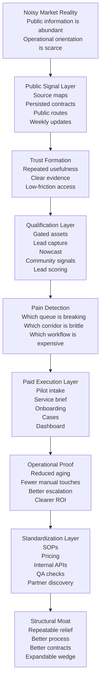

# Research Arc Diagram

## One-Page Framework

## Interpretation

### Story Box

The repo tells one story from left to right:

- information is noisy
- public signal creates orientation
- orientation builds trust
- trust plus pain creates demand
- demand becomes paid execution
- repeated execution becomes system

### Method Box

The repo implements that story from left to right:

- define one wedge
- persist one signal contract
- render it publicly
- capture and score intent
- run one narrow pilot
- track cases and outcomes
- standardize the winning pattern

## Practical Rule

If a proposed addition does not strengthen one of these boxes, it is probably outside the core method of the repo.
